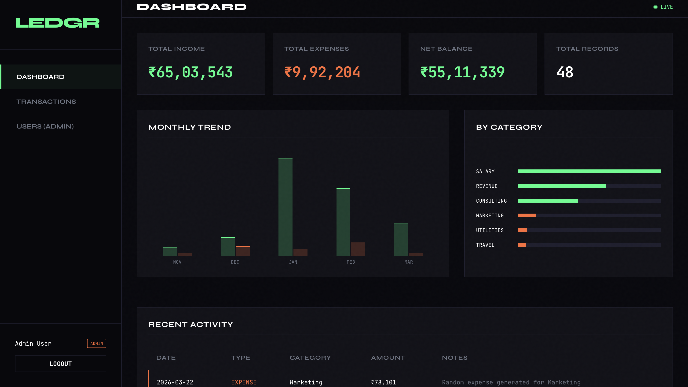
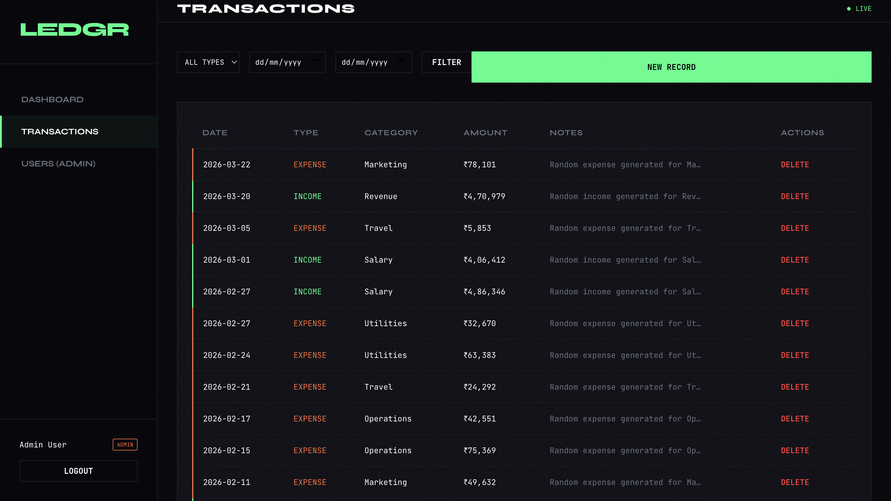
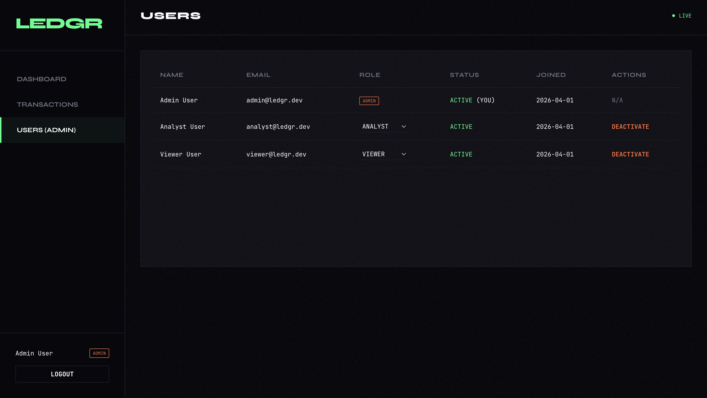
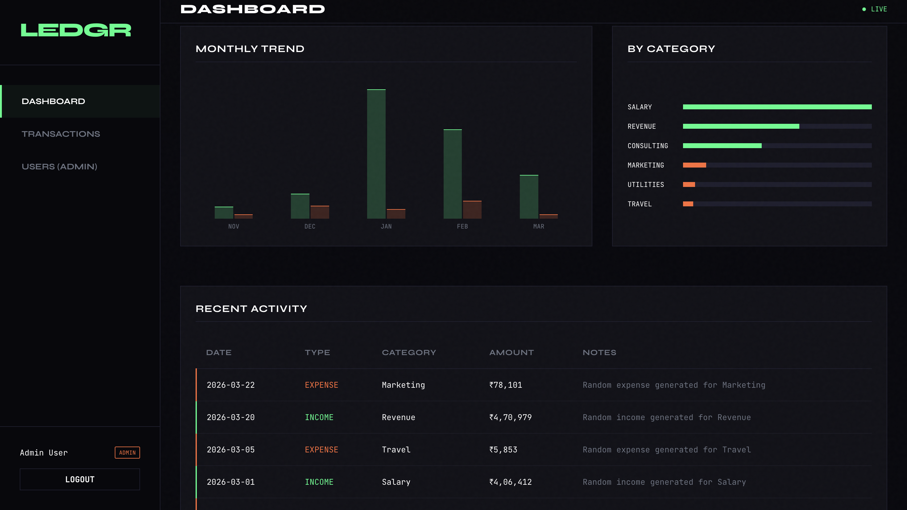
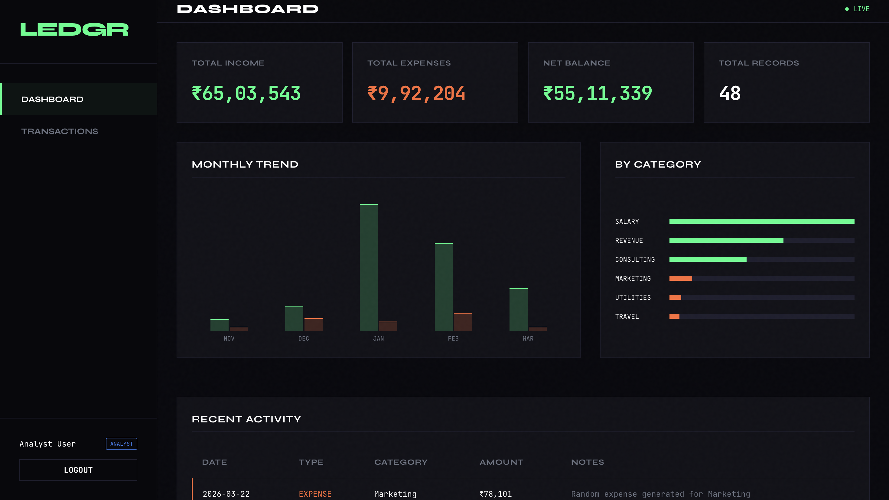
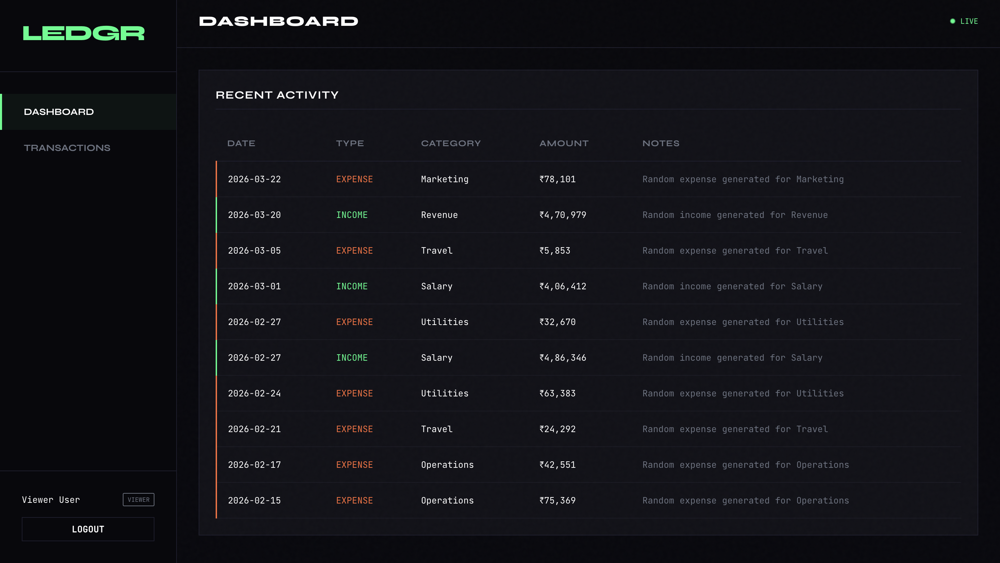

# Finance Data Processing and Access Control Backend

**Submission for Backend Developer Intern Assignment @ Zorvyn**
**Submitted By:** Anikesh Kumar (`anikeshkr0001@gmail.com`)

An enterprise-ready Finance Data Processing backend built in Python (Flask) mapping exactly to the project requirements. The project pairs robust API design, JWT-based security policies, and intuitive data modeling to provide a highly scalable financial dashboard backend.

---

## 🎯 Objective Fulfillment

This project demonstrates clean architecture, scalable application logic, explicit data flow, and stringent role-based access control (RBAC). A Brutalist "Dark Editorial" Vanilla JavaScript single-page frontend is statically mounted to allow immediate functional testing of all the APIs and Dashboard flows without needing Postman.

## Screenshots

<div align="center">
  
  
</div>
<div align="center">
  
  
</div>
<div align="center">
  
  
</div>

---

## 🏗 Core Requirements Implemented

### 1. User and Role Management
Users can be registered, assigned specific roles, and dynamically toggled between active/inactive states.
* **Viewer:** Strictly read-only access to standard transactions. No create/modify rights.
* **Analyst:** Can view transaction data **plus** access the highly aggregated summary APIs.
* **Admin:** Full CRUD control over transactions, users, and all analytical endpoints.

### 2. Financial Records Management
Transactions are logged with precise validations (`Amount`, `Type: income/expense`, `Category`, `Date`, `Notes`, `Created_By`). The application allows standard records management including comprehensive querying through URL query params like `start_date`, `end_date`, `type`, and `category`.

### 3. Dashboard Summary APIs
Instead of simple CRUD operations, the `/api/dashboard/*` endpoints perform advanced aggregation at the database layer using SQLAlchemy's `func`:
* `/summary`: Real-time calculation of total income, expenses, net balance, and record counts.
* `/by-category`: Aggregation grouped by category.
* `/trends`: A rolling 6-month historical sum for dynamic UI charting.
* `/recent`: Optimised query filtering the last 10 entries globally.

### 4. Access Control Logic (The `@require_roles` Decorator)
A custom HTTP middleware decorator was engineered (`app/middleware/rbac.py`). Rather than scattering permission logics across routes, any API route can simply be decorated with `@require_roles('viewer', 'admin')`. The decorator safely intercepts the JWT token, cross-references and validates the User table state, checks the `is_active` boolean, and issues a standard HTTP `403 FORBIDDEN` if restrictions apply.

### 5. Validation and Error Handling
Data flow is strictly constrained using `marshmallow` schemas (`app/schemas`).
* Incoming JSON is validated rigorously (e.g., verifying amount `> 0`, date format checking).
* If data integrity fails, a unified HTTP `422 UNPROCESSABLE ENTITY` is thrown containing explicit, field-level dictionary traces of what failed.
* Standardized json payloads are piped through utility formatters (`app/utils/responses.py`) to maintain an identical schema (`data`, `message`, `status`) across every single API response.

### 6. Data Persistence
Using **SQLite** via **Flask-SQLAlchemy**. This perfectly mocks a scalable relational database with minimal setup requirements. Relationships mapping `User` <-> `Transaction` enforce standard relational integrity.

---

## 🚀 Optional Enhancements Included

1. **Authentication Tokenization**: Secured solely via `Flask-JWT-Extended`.
2. **Server-Side Pagination**: Implemented `?page=x&per_page=y` logic to prevent DOS payloads on the `/api/transactions` lists.
3. **Soft Delete**: `HTTP DELETE` commands don't actually erase memory! Data mutation is strictly prohibited; the system sets `is_deleted = True` and universally filters out deleted entries across all aggregates and searches.
4. **Automated DB Seeding**: The `seed.py` dynamically injects realistic algorithmic data (spanning 6 months) to immediately bring the dashboards to life out-of-the-box.

---

## 💻 Technical Stack Overview

* **Backend Language:** Python 3.10+
* **Framework:** Flask (utilizing scalable Blueprints mapping)
* **ORM & Database:** SQLAlchemy over SQLite
* **Serialisation/Validation:** Marshmallow
* **Authentication:** Flask-JWT-Extended
* **Frontend Setup:** Pure Vanilla JavaScript, HTML5 templates, CSS3

---

## ⚙️ Setup and Installation

### 1. Requirements Tracker
Make sure you have `python3` (or `python`) & `venv` installed.

### 2. Get Running Immediately
```bash
# 1. Clone the repository and navigate into the project
cd ledgr

# 2. Setup your virtual sandbox environment
python3 -m venv venv
source venv/bin/activate

# 3. Setup backend dependencies
pip install -r requirements.txt

# 4. Magically generate the structural database with randomized testing data
python3 seed.py

# 5. Boot the live server
python3 run.py
```

### 3. Verification
Open your browser exactly to `http://localhost:5001`.

**The database seeder automatically provides 3 accounts for you to sandbox test the Role permissions.**
| Scenario | Email | Password | Allowed Access Overview |
|---|---|---|---|
| Admin Flow | `admin@ledgr.dev` | `Admin@123` | Full DB & User Management Read/Write |
| Analyst Flow | `analyst@ledgr.dev` | `Analyst@123` | Read-only Transactions, Analytics Read |
| Viewer Flow | `viewer@ledgr.dev` | `Viewer@123` | Read-only Transactions, NO Analytics |

---

## 🔎 API Documentation

Base URI: `/api`

### Auth (`POST /auth/login`)
Standard sign-in payload requesting `{email, password}`. Dispatches the JWT structure back for client-storage. Register is also supported `/auth/register`.

### Users (`GET, PATCH, DELETE /users/*`)
Restricted securely to `admin`. Maps to the SPA "Users" administration panel.

### Transactions (`GET, POST, PATCH, DELETE /transactions/*`)
RESTful principles applied. 
`GET /transactions` handles query params directly over `start_date`, `end_date`, `type`, and `category` logic maps.

### Dashboards (`GET /dashboard/*`)
`viewer` roles will trip a `403 Forbidden` response here to respect proper information compartmentalization policies. Evaluators can log in smoothly as `analyst` and `viewer` independently to verify this backend block.

---
*Developed by Anikesh Kumar for the Zorvyn Backend Developer Assignment.*
